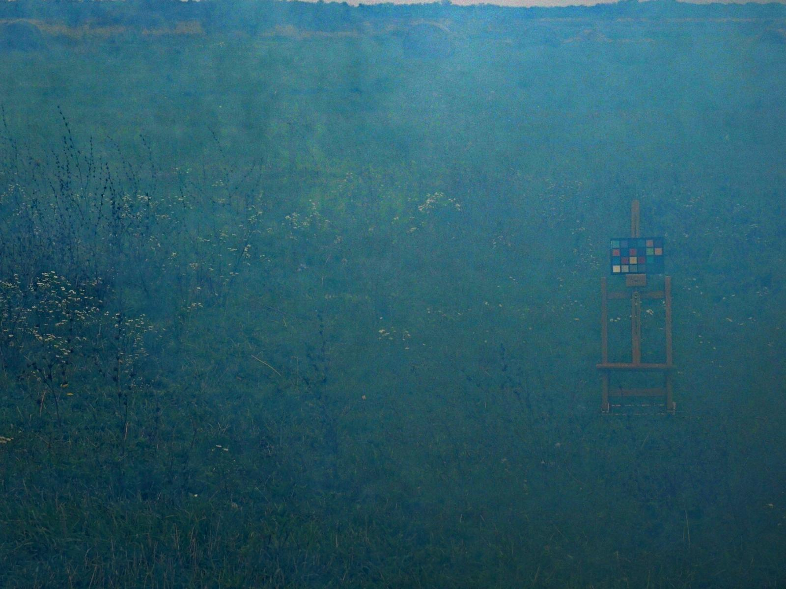

# Image Dehazer

Welcome to Image Dehazer, a Python tool for removing haze from images. This repository provides a comprehensive solution for enhancing the clarity and quality of hazy images.

<br>

## Features
- Removal of haze from images using a guided filter-based algorithm.
- Graphical user interface (GUI) for easy selection and processing of images.
- Sample input images provided for testing the tool.

<br>

## File Structure
The repository is organized as follows:

- **gf.py:** Contains functions for guided filtering.
- **haze_remover.py:** Implements the haze removal algorithm using guided filtering.
- **main.py:** Provides a graphical user interface (GUI) for selecting and processing images.
- **Sample Input Images:** Provides the images for testing and demonstration.
- **img/:** Directory containing sample input images (**src.jpg**, **dark.jpg**, **trans.jpg**, **gtrans.jpg**) and the resulting dehazed image (**dst.jpg**).

    1. **src.jpg:** Original hazy image, serving as input for haze removal.
    2. **dark.jpg:** Dark channel prior of the original hazy image.
    3. **trans.jpg:** Estimated transmission map of the original hazy image.
    4. **gtrans.jpg:** Alternative transmission map estimation for comparison.
    5. **dst.jpg:** Resulting dehazed image after applying Image Dehazer algorithm.

- **dehazed.jpg:** Resulting dehazed image after processing using the tool.
- **requirements.txt:** To specify the dependencies required by the project.

<br>

## Installation
Getting started with Image Dehazer is simple. Follow these steps to set up the tool on your machine:

1. **Clone Repository:** Clone this repository to your local machine:

```bash
    git clone https://github.com/Danish-Jamil-01/Image-Dehazer.git
```
<br>

2. **Navigate to Directory:** Move into the cloned repository directory:

```bash
    cd Image-Dehazer
```
<br>

3. **Install Dependencies:** Install the required dependencies using pip:

```bash
    pip install -r requirements.txt
```

<br>

## Parameters by default
- radius=7
- omega=0.95
- t0=0.1
- r=20
- eps=0.001

<br>

## Usage
After installing the dependencies, you can use the Image Remover Tool as follows:

1. **Run Script:** Execute the main.py script to launch the graphical user interface (GUI):
```bash
    python main.py
```
<br>

2. **Select Image:** Use the GUI to select an image for haze removal. Alternatively, you can manually enter the image path.

3. **Process Image:** Click the "Submit" button to initiate the haze removal process. The tool will display the dehazed image in the GUI.

4. **Save Output:** The dehazed image will be saved as dehazed.jpg in the repository directory.

<br>

## Demo

### Input:
<figure class="half">
    
</figure>

### Output:
<figure class="half">
    
</figure>
<br>

## References

- [Single Image Haze Removal using Dark Channel Prior](https://ieeexplore.ieee.org/document/5567108)
- [Guided Image Filtering](https://ieeexplore.ieee.org/document/6319316)
- [Single Image Dehazing via Conditional Generative Adversarial Network](https://ieeexplore.ieee.org/document/8578954)
- [Single image dehazing based on learning of haze layers](https://www.sciencedirect.com/science/article/abs/pii/S092523122030028X)
- [Dark channel prior in low frequency domain for time-efficient single image dehazing](https://www.tandfonline.com/doi/abs/10.1080/19479832.2024.2314503)

<br>
 
## License
This project is licensed under the [MIT License](LICENSE).
